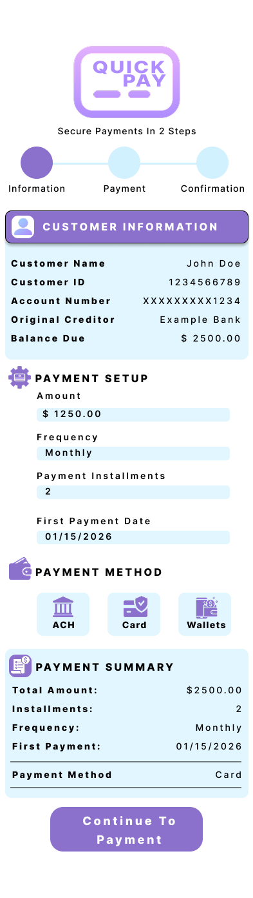
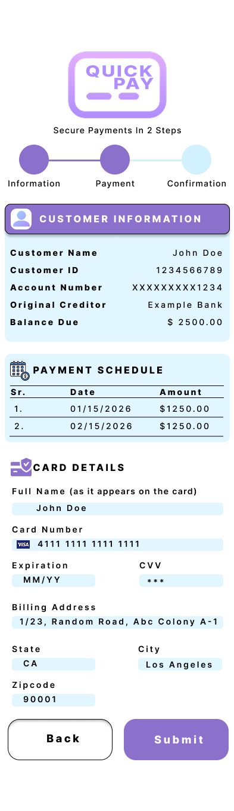
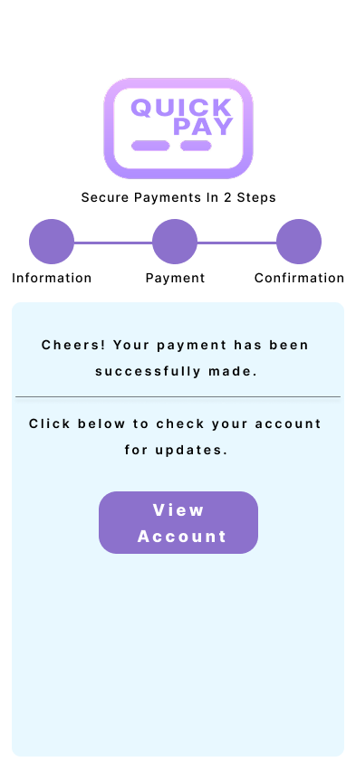

# Quick Pay – Reducing Payment Friction with Secure, Login-less Flows

## Overview
Quick Pay is a mobile-first, frictionless payment experience designed to help customers complete payments quickly and securely, without requiring account login. The product was built to address high bounce rates observed in the existing payment journey, especially for customers arriving via SMS notifications and attempting to pay on the go.

The solution simplifies the payment journey into a 2-step flow, while still preserving flexibility, security, and compliance requirements expected in a regulated payments environment.

---

## Problem Statement
While ~**80% of web traffic** to the payment platform originated from **SMS notifications**, a significant portion of users were dropping off at the **login page**.

### Key issues identified
- Customers showed **high intent to pay** (clicked SMS links) but abandoned the journey when asked to log in.
- Login friction (credentials, password recall, multi-step authentication) was especially problematic for:
  - mobile users
  - time-sensitive payment reminders
  - customers attempting quick, one-time actions
- The existing logged-in experience offered rich account control, but lacked a **clear, fast call-to-action** for immediate payment.

As a result, customers who wanted to “pay now” faced unnecessary friction, leading to:
- higher bounce rates
- delayed payments
- lost collection opportunities

---

## Product Objective
Design a **low-friction, secure payment flow** that:
- enables fast payment completion without login
- aligns with SMS-driven, intent-based user behavior
- preserves flexibility for customers who need installment-based payments
- adheres to security and compliance best practices

---

## Solution: Quick Pay Portal
Quick Pay is a secure, login-less payment portal, accessed via a unique, time-bound link sent to customers.

### Core design principles
- **One clear action:** Set up and complete payment
- **Minimal distractions:** No account exploration required
- **Speed with flexibility:** Fast defaults with optional customization
- **Security by design:** Controlled access and expiry

---

## Customer Journey (2-Step Flow)
Below are anonymized, mobile-first wireframes recreated for portfolio demonstration to illustrate the frictionless Quick Pay flow.

### Step 1: Quick Pay Setup
Customers land directly on the Quick Pay screen where key details are **auto-populated** to reduce effort:
- Outstanding balance
- Default full one-time payment amount
- Previously saved card / wallet (when available)

Customers can:
- proceed with a quick full payment, **or**
- customize a payment plan by selecting:
  - amount
  - frequency
  - number of installments

To maintain responsible payment planning:
- installment plans are capped at a maximum of **24**
- eligibility varies based on **Customer Lifetime Value (CLV)** and payment behavior:
  - customers with positive indicators are eligible for longer plans
  - customers with weaker payment history are offered shorter plans

This ensures flexibility without increasing risk.

### Step 2: Payment Details
Customers confirm payment using:
- Card or Bank (ACH)
- Billing information (for compliance)
- Digital Wallet 

A clear summary of the payment schedule is shown before final submission to reinforce transparency and trust.

### Step 3: Confirmation
Upon successful payment:
- customers receive immediate confirmation
- the Quick Pay link becomes invalid after its defined expiry window
- customers can optionally continue to their account for updates

---

## Wireframes (Mobile-first)

### Screen 1: Quick Pay Setup

### Screen 2: Payment Details

### Screen 3: Confirmation

---

## Clickable Prototype
A clickable mobile prototype was created to simulate the end-to-end Quick Pay experience.

- Purpose: Demonstrate interaction flow and step transitions
- Scope: Payment setup → payment details → confirmation
- Note: This prototype is recreated solely for portfolio demonstration and does not represent a live production system.

🔗 **View prototype:** [Figma Prototype Link](https://www.figma.com/proto/oJIE32K6yRMRpPp57O4roQ/Quick-Pay-Wireframe?node-id=1-3&p=f&t=98YEn275rNNQBgmR-1&scaling=scale-down&content-scaling=fixed&page-id=0%3A1&starting-point-node-id=1%3A3)

---

## Security & Risk Considerations
- Each Quick Pay link is:
  - **customer-specific**
  - **time-bound (24-hour expiry policy)** to minimize misuse risk
- All traffic is protected using **TLS encryption** to ensure secure data transmission
- Links automatically expire after 24 hours and require regeneration via a new notification
- No login credentials are required, but access is tightly controlled at the link level
- Sensitive details are never exposed beyond the minimum required for payment
- Design adheres to internal security best practices and compliance expectations

---

## Impact & Outcomes
The Quick Pay portal delivered measurable improvements:
- **+15% increase in completed payments**
- Lower bounce rate compared to the login-based flow
- Faster payment completion due to reduced steps
- Increased top-of-funnel effectiveness from SMS campaigns
- Improved alignment with “pay now” customer intent

The combination of clear call-to-action, low distraction, and auto-populated defaults significantly improved conversion without sacrificing control or security.

---

## Trade-offs & Learnings
- Removing login increased conversion but required tighter link-level security controls
- Balancing flexibility (installments) with risk required CLV-based eligibility rules
- Defaulting to full payment accelerated outcomes, while still respecting customer choice

---

## Future Enhancements (AI Opportunities)
While Quick Pay is rules-driven today, the design enables future AI-led improvements, such as:
- Predictive recommendation of optimal installment plans
- Risk-based dynamic adjustment of payment options
- Intelligent resend timing for payment reminders
- Next-best-channel selection (SMS vs email vs wallet notifications)

---

## Role & Ownership
In this initiative, I owned:
- problem discovery & funnel analysis
- solution design and PRD creation
- stakeholder alignment (product, engineering, security, compliance)
- delivery coordination
- post-launch measurement and optimization

---

## Why this project matters
Quick Pay demonstrates how simplifying the customer journey, when done intentionally and responsibly, can unlock significant business impact — especially in high-intent, mobile-first use cases.
