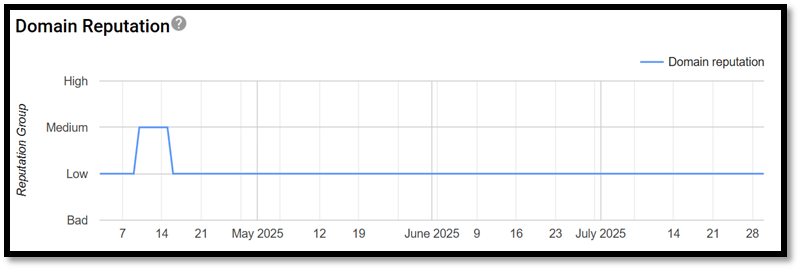
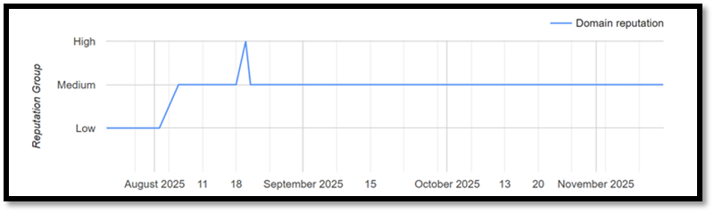
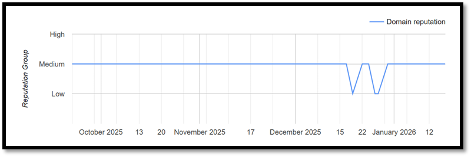
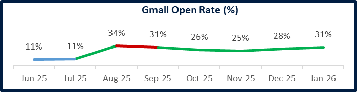

# Email Engagement Enhancement – Restoring Deliverability & Improving Open Rates

## Overview
Email is a critical engagement channel in collections, but due to the nature of the business, messages are highly susceptible to spam filtering, reputation damage, and delivery issues.

This case study covers how I led a cross-functional initiative to **restore email deliverability, improve open rates, and reduce platform risk**, particularly for Gmail users, which accounted for the majority of email traffic.

---

## Context
- Industry: Collections
- Channel: Email (transactional & engagement)
- Gmail accounted for ~**70% of outbound email traffic**
- Email was a key driver for customer engagement and payment actions

However, the channel had effectively become **non-functional** for Gmail users.

---

## Problem Statement
Email open rates were critically low, especially on Gmail. Close to 70% of Email Campaign traffic was Gmail.

### Key challenges identified:
- **Extremely high spam classification** due to the nature of collections messaging
- **Poor domain reputation**, difficult to recover once degraded
- Lack of proper **email authentication**, exposing the parent domain to risk
- Limited **visibility and tracking** into how mailbox providers perceived our emails
- Gmail-specific filtering caused emails to land directly in spam folders
- Open rates for Gmail users dropped to **~0%**
- Multiple escalation attempts with Google support did not resolve the issue

At this point, email as a channel was both **ineffective** and **risky**.

---

## My Role & Ownership
I owned this initiative end-to-end, including:
- Problem diagnosis and root cause analysis
- Tooling and instrumentation decisions
- Cross-functional coordination with server, security, and operations teams
- Experimentation and measurement
- Post-fix monitoring and optimization

---

## Solution Strategy
Rather than treating this as a copy or content problem, I approached it as a **platform and reputation recovery problem**.

The solution focused on **visibility → trust → engagement**.

---

## Key Actions Taken

### 1. Establish visibility & diagnostics
- Implemented **Google Postmaster Tools** and **SNDS** to understand how Gmail and Microsoft perceived our domains and IPs
- Enabled deeper tracking to identify reputation, spam complaints, and delivery signals

---

### 2. Improve compliance & reduce exposure risk
- Implemented **SPF, DKIM, and DMARC** authentication
- Secured the (**parent domain**) from risk exposure
- Added **one-click unsubscribe** to ensure full compliance on Gooogle Postmaster and reduce spam complaints.
- One-Click-Unsubscribe was a functionality additional to regular Unsubscribe or Optout method

---

### 3. Infrastructure & reputation optimization
- Introduced **load balancing across domains and IPs** based on performance
- Segregated traffic to isolate and protect high-performing domains

---

### 4. Content & engagement experimentation
- Ran experiments on:
  - subject lines
  - keyword placement in email body and footer
- Enhanced email event pipelines to generate more **actionable engagement data** for ongoing strategy

---

### 5. AI-assisted quality control
- Built a **custom AI-powered GPT** to evaluate debt collection emails
- Used it to assess tone, compliance risk as per FDCPA regulations and engagement quality before sending

---

## Results & Impact

The initiative led to a significant recovery of the email channel:

### Gmail Open Rates
- **Domain 1:** Increased from **~2.5% → ~30%**
  - Nearly on par with **AMEX first-party open rates**
- **Domain 2:** Increased from **~0.2% → ~10%**

### Domain Reputation: Initially 

### Domain Reputation: In Progress

### Domain Reputation: Finally Stable

### Gmail Open Rate %: Increased dramaticaly by 170% (11% previously to 30%)

### Additional outcomes
- Restored email as a viable engagement channel
- Reduced long-term domain and compliance risk
- Improved trust signals with mailbox providers
- Enabled data-driven optimization instead of reactive firefighting

---

## Key Learnings
- Deliverability is a **product & platform problem**, not just a content problem
- Reputation recovery requires patience, instrumentation, and cross-functional ownership
- Compliance features (unsubscribe, authentication) directly impact engagement outcomes
- AI can be effectively used for **pre-send quality checks**, not just personalization

---

## Why this case study matters
This project demonstrates how product thinking can be applied beyond UI and features — to **infrastructure, trust, compliance, and growth systems** that directly affect revenue and customer engagement.